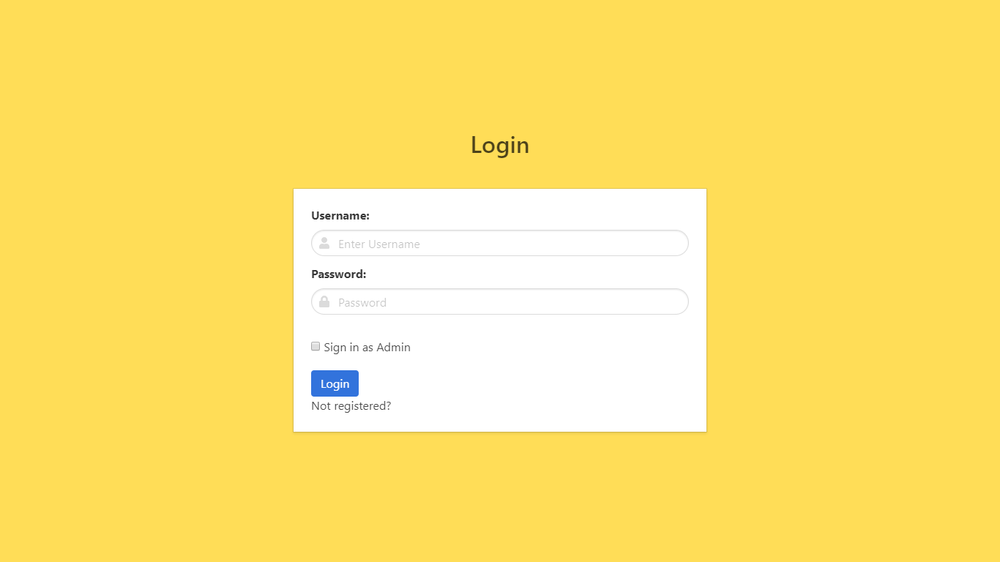
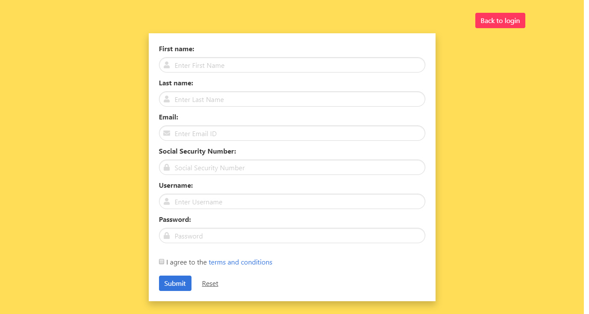
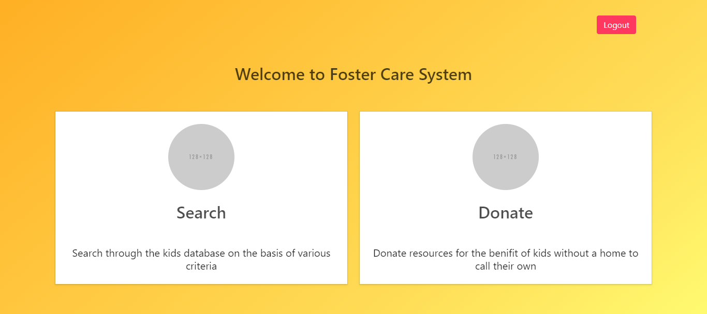
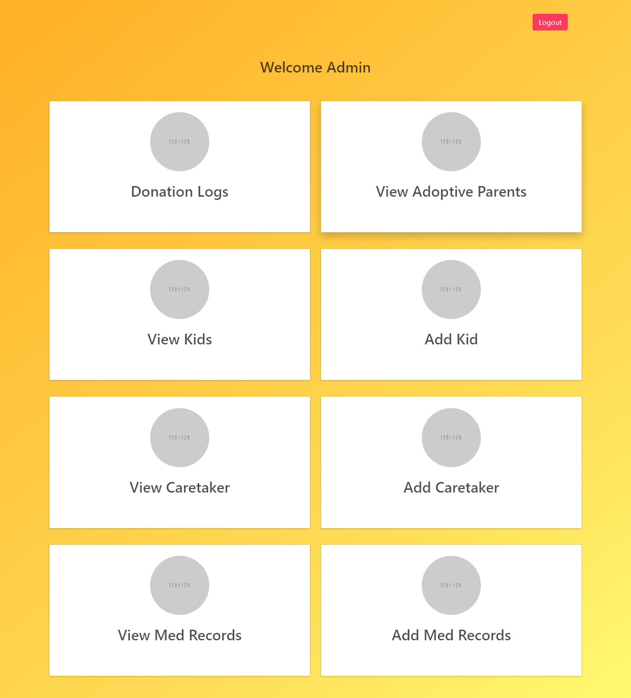

#Foster care Management system 

  •	It is a Website which can be used to connect people who are looking to adopt a foster kid from their nearby foster home.
  
  •	Interested people can Sign up and based on background check-up they will be allowed to adopt a kid

#Prerequisites

  Install an IDE(eg:- Eclipse)
  
  Install Apache server
  
  Install MySQL
  
  Download MYsql connector

#WebSite preview
 
 *Login page*
 
 
 *Registration page*
 
 
 *Dashboard*
 
 
 *admin_panel*
 
 
 
